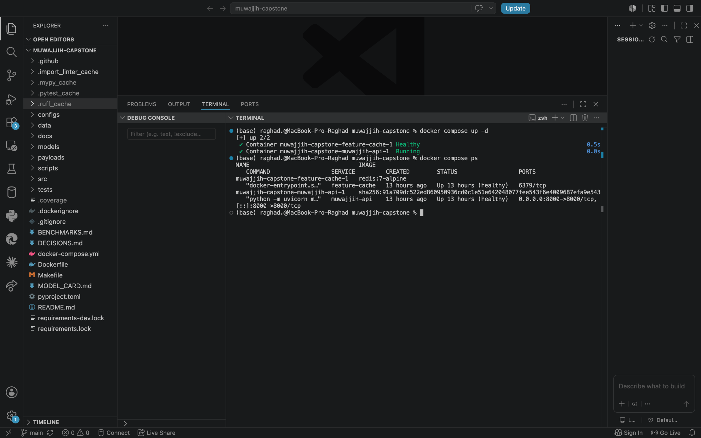
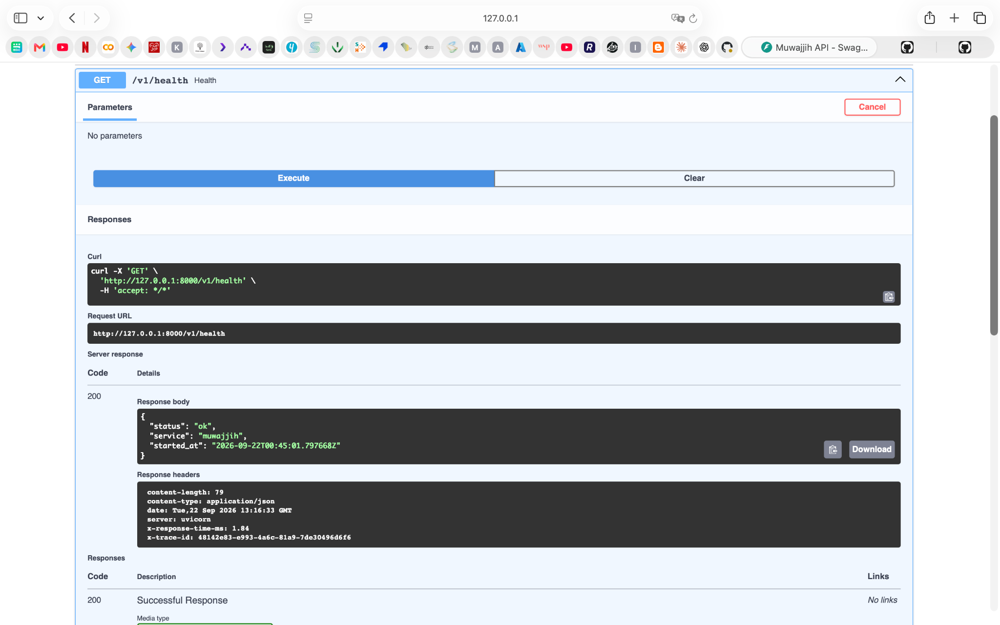
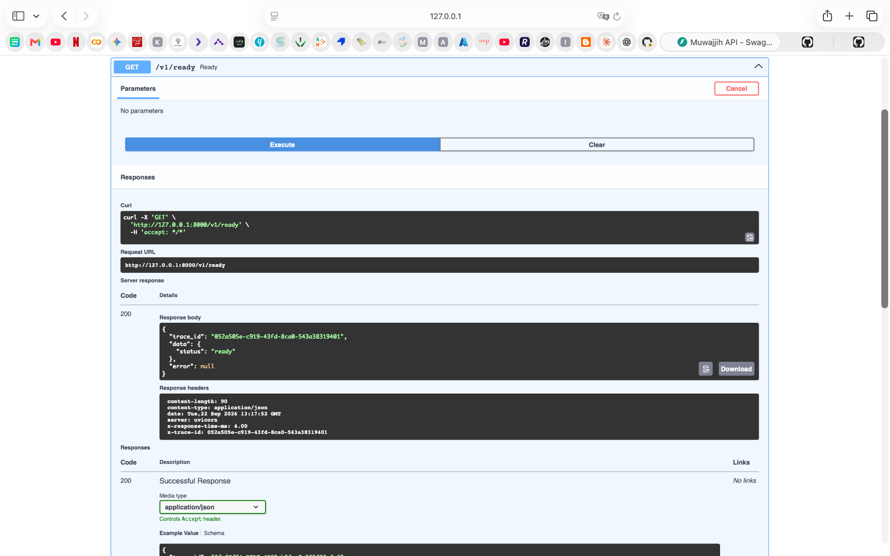
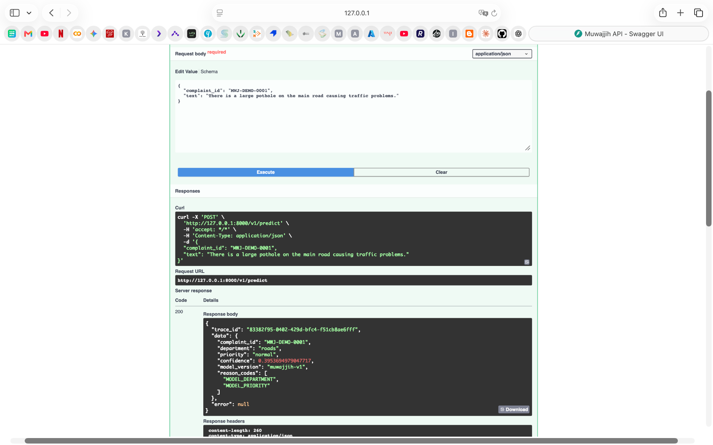
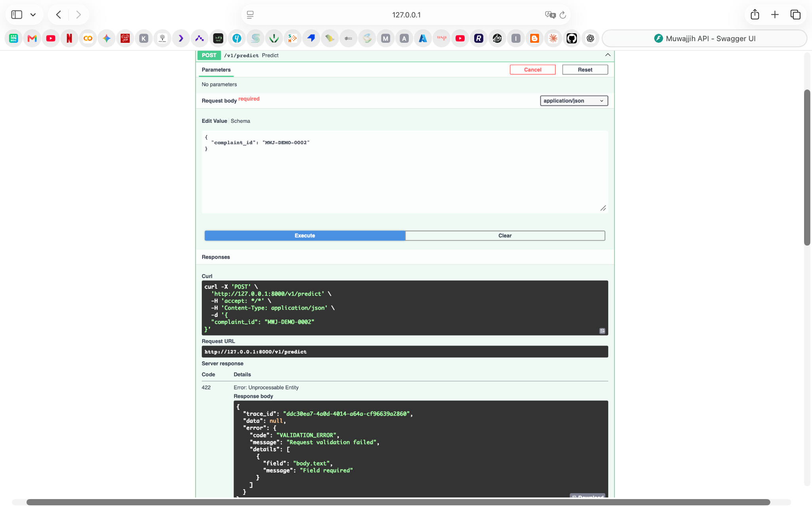
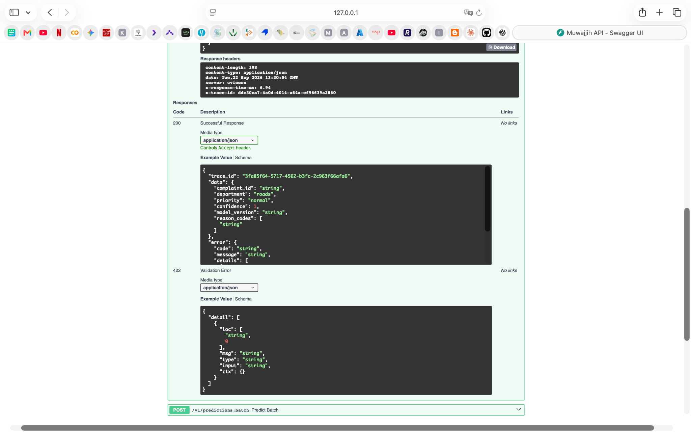
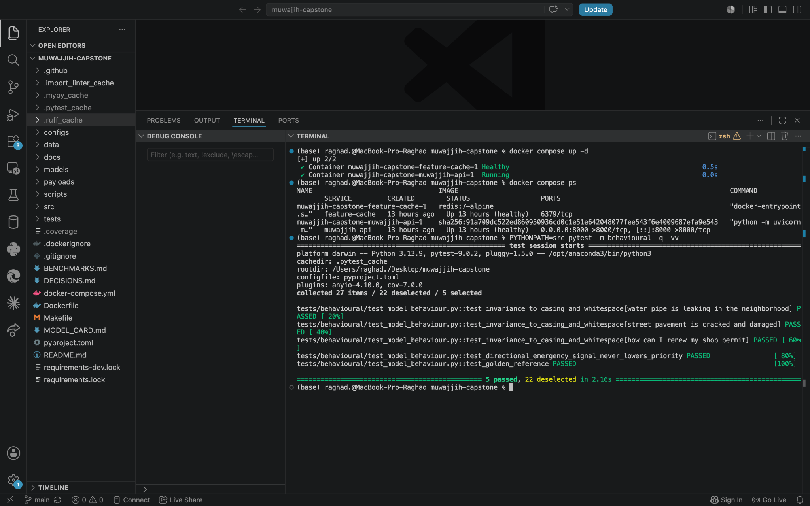
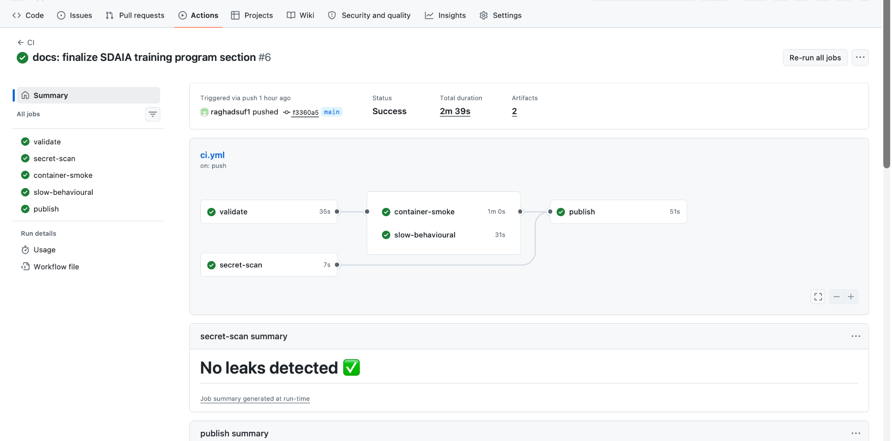
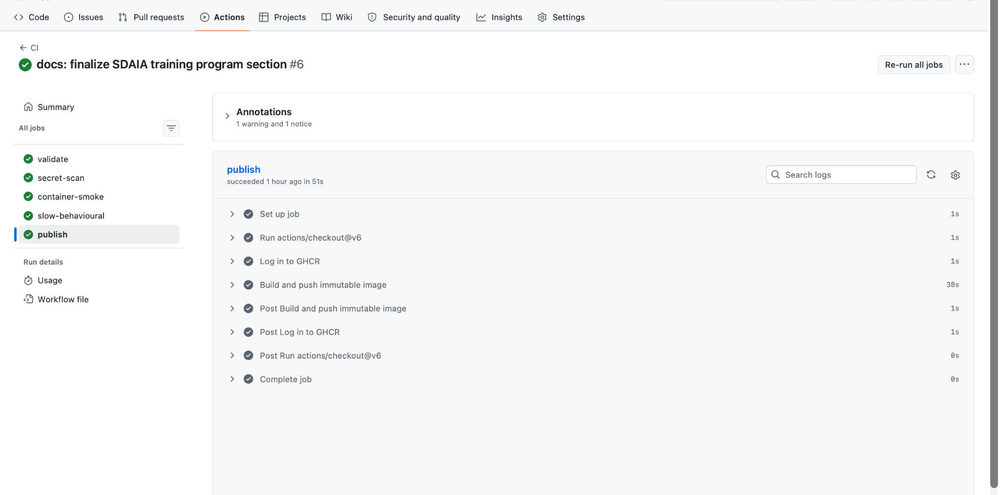

# Muwajjih — Demo Evidence

This folder contains the screenshot evidence used for the Muwajjih capstone demonstration.

## 1. Compose & Service Readiness

The screenshots show the Docker Compose stack running and the API health/readiness endpoints returning successful responses.

## 2. Valid Prediction

A valid municipal complaint is submitted to `POST /v1/predict` and the service returns a structured HTTP 200 response with department, priority, model version, trace ID, and no error.

## 3. Malformed Request & Validation

An invalid request missing the required `text` field is rejected with HTTP 422 and a structured validation error.

## 4. Behavioural Tests

The real behavioural suite passes five selected tests, including invariance, emergency-signal directionality, and a golden-reference test.

## 5. CI/CD & GHCR

The `main` pipeline completes successfully with validation, secret scanning, container smoke testing, behavioural testing, and publishing.

## Suggested demo order

1. Compose + Health/Ready
2. Valid prediction
3. Malformed request
4. Behavioural test
5. CI/CD and GHCR publication
